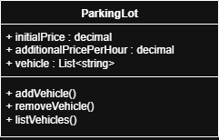

# C# .NET Study Project

This challenge was proposed by DIO for the .NET path course. You can read the original proposal (in Portuguese) by [clicking here](https://github.com/digitalinnovationone/trilha-net-fundamentos-desafio/tree/main). Creating the project from zero instead of forking it was a personal choice. I also made some implementations that weren't asked, on purpose. 

## Proposal
This challenge proposed the building of a parking lot system to manage parked vehicles and execute its operations, such as add a vehicle, remove a vehicle  showing the price charged, and list the actively parked vehicles. In order to do that, it was required to:

- Build a class called Parking Lot, according to the following diagram (adapted to English):
  

- Create three attributes for the class:
    1. **initialPrice** (decimal): Price charged to let the vehicle be parked inside the establishment.
    2. **additionalPricePerHour** (decimal): Price charged for every hour the vehicle remains parked.
    3. **vehicle** (list of strings): Collection of vehicles parked, identified by the license plate.
- Create three methods for the class:
    1. **addVehicle**: Responsible for storing the license plate in the **vehicle** variable.
    2. **removeVehicle**: Responsible for verifying if a given vehicle is parked, and questioning the quantity of hours it remained parked, calculating and showing the final price. 
    3. **listVehicles**: Must show every present vehicle (added and not removed). A message should inform the user if there's no vehicle parked.
- Construct an interactive menu with the following actions:
    1. Register vehicle.
    2. Remove vehicle.
    3. List vehicle.
    4. Shut down the program.

## What else to expect

- When adding or removing a vehicle, the program should not accept an empty or blank answer.
- When adding or removing a vehicle, the program should always give the user a return about the storage status.
- When adding a vehicle, the program should not accept a license plate already stored in the list.
- When removing a vehicle, the program should alert if there's no vehicle parked under the given license plate.
- I created a class called **Manager** to execute the actions that are considered system actions, in order to keep the project organized, with the following methods:
    1. **Welcome**: Show a welcome message.
    2. **SetUpPrices**: Ask the user about the initial price and the aditional price per hour, and send the answer to storage in the parking lot class.
    > No particular currency system was defined, therefore, the OS will use the one set up in your configurations. For that particular reason, no currency sign is used, and the prices can be changed through a menu option so the value can be corrected in case the wrong separating variation was informed and ignored (comma/dot).
    3. **ShowMenu**: Show all the actions the user can make.
    4. **WaitForResponse**: This method is called at the final of other methods, so the user can read the console return (success/failure/orientation) before being sent back to the menu. The waiting is skipped by pressing any key.  

## How to run the program

To run this program locally, make sure you have the [.NET SDK 9.0](https://dotnet.microsoft.com/pt-br/download) version installed.

Go to the directory you wish to download the project into, and:
1. Clone this repository.
```bash
git clone https://github.com/vanedq/parking-lot-manager
```
2. Enter the cloned repository.
```bash
cd parking-lot-manager
```
3. Build the project.
```bash
dotnet build
```
4. Run the project.
```bash
dotnet run
```


#### This is a very simple console program, required to advance the .NET course. Suggestions are very welcome and can be sent through the Issues option, under the repository name. Feel free to contact me anytime via [LinkedIn](https://www.linkedin.com/in/vanessadquadros/).
